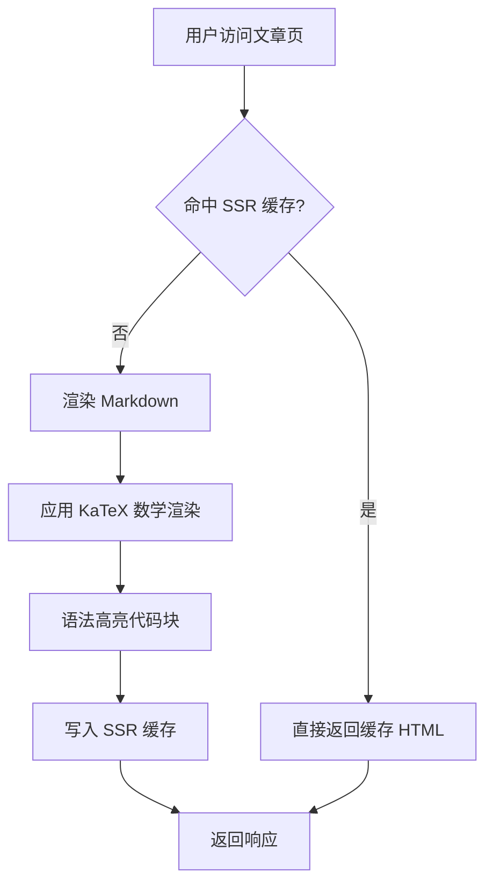
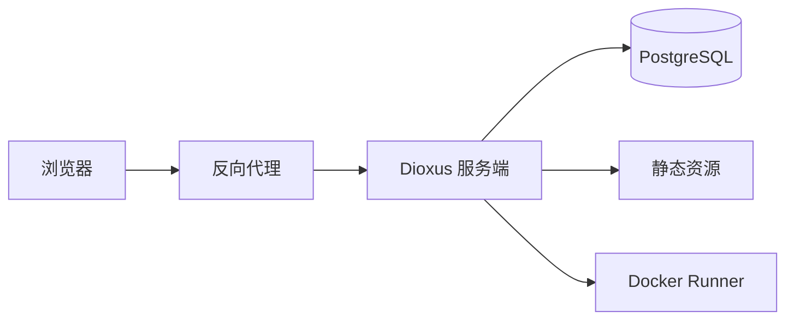
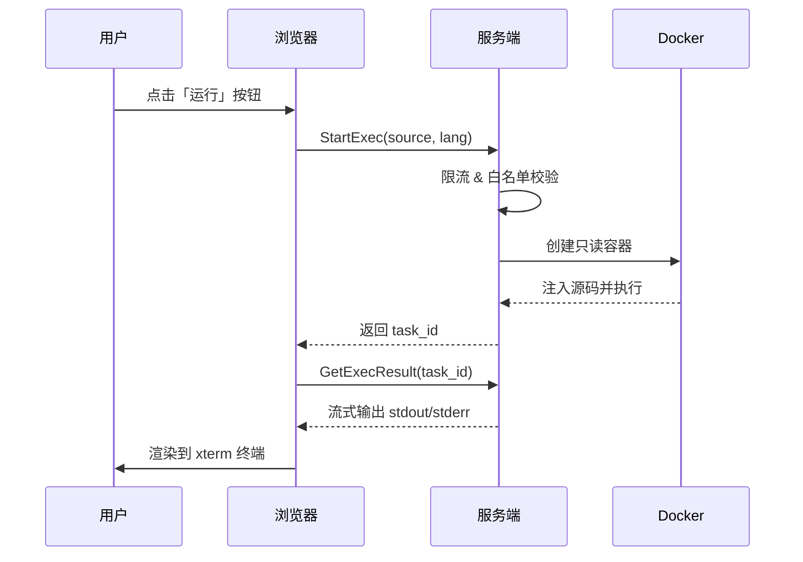
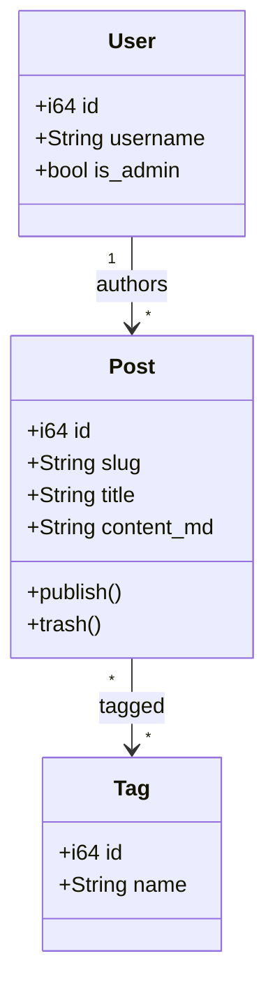
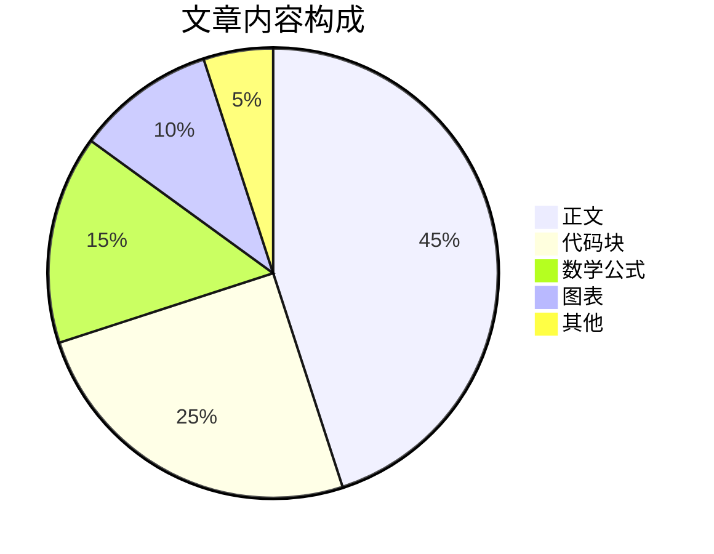

# Markdown 全特性测试文章

> 这是一份用于测试 yggdrasil 博客系统 Markdown 渲染管线的综合性文章，覆盖：标题层级、强调、引用、列表、任务列表、表格、代码高亮（含 Kotlin/Swift/Vue 自定义语法）、数学公式（KaTeX 行内 + 块级）、Mermaid 流程图、Runnable 代码块、脚注、链接、分割线等全部特性。

## 一、标题层级

以下从 H2 到 H6 依次展开（H1 已被文章标题占用）。

### 三级标题 H3

#### 四级标题 H4

##### 五级标题 H5

###### 六级标题 H6

## 二、强调与文本样式

**这是粗体文本**，_这是斜体文本_，_**这是粗斜体**_，~~这是删除线~~。

还可以**嵌*套*使用**强调，也可以混合~~删除**与粗体**线~~。

行内代码：使用 `cargo build --release` 构建项目，或运行 `make dev` 启动开发服务器。

> [!NOTE]
> 如果不支持 GitHub 风格的告示框，上面这一行会显示为普通引用。

## 三、段落与换行

这是第一段。同一段落内的软换行（单个换行符）在渲染时会被合并为一个空格。

这是第二段。段落之间需要留一个空行。

如果要强制换行，可以在行尾加两个空格，  
或者使用 `<br>` 标签<br>来强制换行。

## 四、引用块

> 这是单层引用块。引用块内可以包含 **强调**、`行内代码`、[链接](https://example.com) 等。

> > 这是嵌套引用块，第二层。

> 引用块里也可以有列表：
>
> 1. 第一项
> 2. 第二项
>
> 以及代码：
>
>     let x = 42;

## 五、列表

### 无序列表

- 第一项
- 第二项
  - 嵌套项 2.1
  - 嵌套项 2.2
    - 更深一层 2.2.1
- 第三项

### 有序列表

1. 第一步：克隆仓库
2. 第二步：安装依赖
   1. 子步骤 2.1
   2. 子步骤 2.2
3. 第三步：启动服务

### 任务列表

- [x] 配置 Rust 工具链（1.95+）
- [x] 安装 `dx` CLI
- [x] 准备 PostgreSQL
- [ ] 编写单元测试
- [ ] 部署到生产环境

## 六、表格

### 简单表格

| 语言       | 扩展名 | 是否可运行 | 默认超时 |
| ---------- | ------ | ---------- | -------- |
| Python     | py     | ✅         | 5s       |
| Node.js    | js     | ✅         | 5s       |
| Go         | go     | ✅         | 10s      |
| Rust       | rs     | ✅         | 15s      |
| TypeScript | ts     | ❌         | —        |

### 对齐方式不同的表格

| 左对齐    |  居中对齐   |     右对齐 |
| :-------- | :---------: | ---------: |
| Left cell | Center cell | Right cell |
| 第二行    |   第二行    |     第二行 |

## 七、代码块（语法高亮）

### Rust

```rust
use std::collections::HashMap;

fn main() {
    let mut map = HashMap::new();
    map.insert("answer", 42);
    for (k, v) in &map {
        println!("{k} = {v}");
    }
}
```

### Python

```python
from dataclasses import dataclass
from typing import List

@dataclass
class Point:
    x: float
    y: float

def centroid(points: List[Point]) -> Point:
    n = len(points)
    return Point(
        x=sum(p.x for p in points) / n,
        y=sum(p.y for p in points) / n,
    )
```

### Kotlin（项目自定义语法定义）

```kotlin
data class User(val name: String, val age: Int)

fun main() {
    val users = listOf(User("Alice", 30), User("Bob", 25))
    users.filter { it.age >= 28 }
         .sortedByDescending { it.age }
         .forEach { println("${it.name}: ${it.age}") }
}
```

### Swift（项目自定义语法定义）

```swift
import Foundation

struct Greeting {
    let message: String
    func say(to name: String) -> String {
        return "\(message), \(name)!"
    }
}

let g = Greeting(message: "Hello")
print(g.say(to: "world"))
```

### TypeScript（项目自定义语法定义）

```typescript
interface Todo {
  id: number;
  title: string;
  done: boolean;
}

function toggle(todo: Todo): Todo {
  return { ...todo, done: !todo.done };
}
```

### TSX（项目自定义语法定义）

```tsx
import { useState } from "react";

export function Counter() {
  const [count, setCount] = useState(0);
  return (
    <button onClick={() => setCount((c) => c + 1)}>
      clicked {count} times
    </button>
  );
}
```

### Vue SFC（项目自定义语法定义）

```vue
<template>
  <div class="hello" @click="onClick">{{ message }}</div>
</template>

<script setup lang="ts">
import { ref } from "vue";
const message = ref<string>("Hello Vue!");
function onClick() {
  message.value += "!";
}
</script>

<style scoped>
.hello {
  color: #42b883;
}
</style>
```

### Zig（项目自定义语法定义）

```zig
const std = @import("std");

pub fn main() void {
    std.debug.print("Hello, {s}!\n", .{"Zig"});
}
```

### Shell

```bash
# 构建并部署
make build
docker compose up -d
tail -f /var/log/yggdrasil.log
```

### SQL

```sql
SELECT
    u.id,
    u.name,
    COUNT(p.id) AS post_count
FROM users u
LEFT JOIN posts p ON p.author_id = u.id
WHERE u.created_at > NOW() - INTERVAL '30 days'
GROUP BY u.id, u.name
ORDER BY post_count DESC
LIMIT 10;
```

### JSON

```json
{
  "name": "yggdrasil",
  "version": "1.0.0",
  "features": ["fullstack", "ssr", "markdown"],
  "rust_version": "1.95"
}
```

### 不带语言标识的代码块

```
这是一段没有语言标识的代码块。
应当以纯文本形式渲染（无语法高亮）。
```

## 八、数学公式（KaTeX 服务端渲染）

### 行内公式

- 质能方程：$E = mc^2$
- 勾股定理：$a^2 + b^2 = c^2$
- 欧拉恒等式：$e^{i\pi} + 1 = 0$
- 黄金比例：$\varphi = \frac{1 + \sqrt{5}}{2} \approx 1.618$
- 求和：$\displaystyle\sum_{i=1}^{n} i = \frac{n(n+1)}{2}$

### 块级公式

$$
\int_{-\infty}^{\infty} e^{-x^2}\,dx = \sqrt{\pi}
$$

$$
\frac{\partial}{\partial t} \rho + \nabla \cdot (\rho \vec{v}) = 0
$$

$$
\hat{H}\Psi = E\Psi \quad \text{(薛定谔方程)}
$$

### 含矩阵与对齐的复杂公式

$$
\begin{aligned}
\nabla \times \vec{B} &= \mu_0 \vec{J} + \mu_0 \varepsilon_0 \frac{\partial \vec{E}}{\partial t} \\
\nabla \times \vec{E} &= -\frac{\partial \vec{B}}{\partial t}
\end{aligned}
$$

$$
A = \begin{pmatrix}
a_{11} & a_{12} & a_{13} \\
a_{21} & a_{22} & a_{23} \\
a_{31} & a_{32} & a_{33}
\end{pmatrix}
$$

### 标题中的公式

## 勾股定理 $a^2 + b^2 = c^2$

> 若 KaTeX 渲染正常，上方二级标题里的 $a^2 + b^2 = c^2$ 应被渲染成数学符号。

## 九、Mermaid 流程图

### 流程图（flowchart）



### 横向流程图



### 时序图



### 类图



### 饼图



## 十、Runnable 代码块（可在浏览器执行）

### Python（最简形式）

```python runnable
import sys
import platform

print(f"Python {sys.version.split()[0]} on {platform.system()}")
for i in range(5):
    print(f"fib({i}) =", (lambda n: round(((1+5**0.5)/2)**n/5**0.5))(i))
```

### Node.js（带资源覆盖）

```javascript runnable {"timeout_secs":10,"memory_mb":256,"cpu_cores":1.0,"output_bytes":4096}
const fib = (n) => (n < 2 ? n : fib(n - 1) + fib(n - 2));
console.log(`Node ${process.version}`);
Array.from({ length: 15 }, (_, i) => console.log(`fib(${i}) = ${fib(i)}`));
```

### Go（`run` 作为 `runnable` 的别名）

```go run
package main

import (
    "fmt"
    "runtime"
)

func main() {
    fmt.Printf("Go %s on %s/%s\n", runtime.Version(), runtime.GOOS, runtime.GOARCH)
    for i := 0; i < 5; i++ {
        fmt.Printf("square(%d) = %d\n", i, i*i)
    }
}
```

### Rust（带 timeout 覆盖）

```rust runnable {"timeout_secs":20}
fn main() {
    println!("Hello from Rust runner!");
    let nums: Vec<i32> = (1..=10).collect();
    let sum: i32 = nums.iter().sum();
    println!("sum(1..=10) = {sum}");
}
```

## 十一、链接与图片

### 链接

- 行内链接：[Dioxus 官网](https://dioxuslabs.com)
- 带标题的链接：[pulldown-cmark](https://docs.rs/pulldown-cmark "Rust Markdown 解析库")
- 自动链接：<https://github.com/DioxusLabs/dioxus>
- 引用式链接：访问 [yggdrasil 仓库][repo] 查看源码。

[repo]: https://github.com/your-org/yggdrasil

### 图片


## 十二、脚注

正文中引用了 PostgreSQL[^1]，渲染管线基于 pulldown-cmark[^pc]，KaTeX 数学渲染来自 `katex-rs`[^katex]，流程图则依赖 mermaid.js[^mermaid]。

同一脚注可以多次引用[^1]，再次引用 PostgreSQL[^1]。

> 脚注 label 含空格也行[^my note]，服务端会把空格清洗为 `-`。

[^1]: PostgreSQL 是一个强大的开源关系型数据库，本项目用 deadpool-postgres 管理连接池。

[^pc]: pulldown-cmark 是 Rust 生态中最快的 CommonMark 解析库之一，支持 GFM 扩展。

[^katex]: katex-rs 是 KaTeX 的 Rust 绑定，本项目以 `OutputFormat::Html` 模式渲染，不输出 MathML，XSS 面最小。

[^mermaid]:
    mermaid.js 通过 IntersectionObserver 在视口可见时动态 import 独立 IIFE bundle，避免首屏加载 ~3.4MB 的成本。
    [^my note]: 这条脚注的 label 是 `my note`，清洗后 id 中空格变为连字符。

## 十三、分割线

上方文字

---

中间分割线

---

再一条分割线

---

下方文字

## 十四、转义字符

下面这些字符在 Markdown 中有特殊含义，前面加 `\` 可原样输出：

\* 星号 \_ 下划线 \` 反引号 \# 井号 \+ 加号 \- 减号 \. 句点 \! 感叹号 \[ \] 方括号 \( \) 圆括号 \{ \} 花括号 \\ 反斜杠

## 十五、混合排版压力测试

> 1. **引用 + 有序列表 + 强调**
> 2. 包含 `行内代码` 和 [链接](https://example.com)。

| 功能       | 渲染器           | 位置         |
| ---------- | ---------------- | ------------ |
| 代码高亮   | syntect          | 服务端       |
| 数学公式   | katex-rs         | 服务端       |
| 流程图     | mermaid.js       | 客户端懒加载 |
| 可运行代码 | bollard + Docker | 服务端容器   |

下面这段同时出现数学公式 $f(x) = x^2$、`inline code`、**强调**、[超链接](https://example.com)和脚注[^mix]：

[^mix]: 这是一条用于混合排版测试的脚注。

$$
\mathcal{F}\{f\}(\xi) = \int_{-\infty}^{\infty} f(x)\,e^{-2\pi i x \xi}\,dx
$$



```mermaid
graph TD
    A[开始] --> B{渲染管线}
    B --> C[Markdown → HTML]
    B --> D[KaTeX 数学]
    B --> E[syntect 高亮]
    B --> F[mermaid 占位]
    C --> G[ammonia 消毒]
    D --> G
    E --> G
    F --> G
    G --> H[SSR 缓存写入]
    H --> I[客户端水合]
    I --> J[mermaid 懒加载渲染]
```

## 十六、Unicode 与多语言

- 中文：世界，你好！
- 日本語：こんにちは世界
- 한국어: 안녕하세요 세계
- العربية: مرحبا بالعالم
- Русский: Привет, мир
- Emoji：🚀 🦀 🌳 ✨ 📝 🔥

---

**测试结束** —— 如果以上所有内容都正确渲染，说明 Markdown 管线工作正常。
